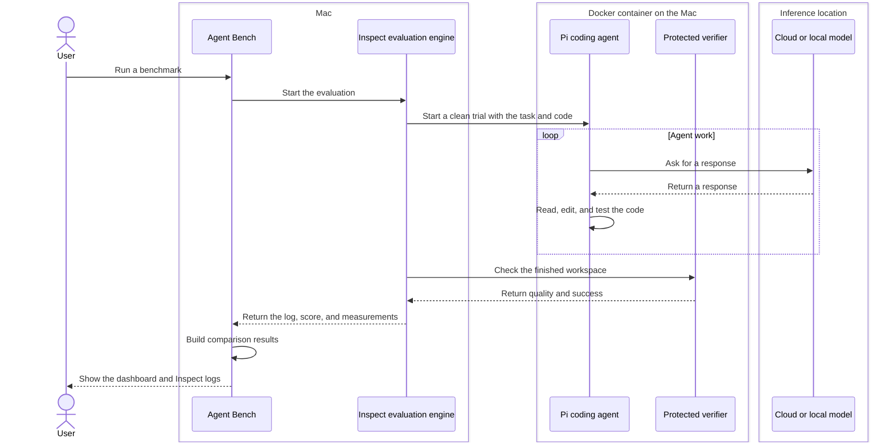

# Pi Agent Bench

Pi Agent Bench helps you compare coding AI models.

It can compare:

- a model running on your own computer;
- a model running on a server such as a DGX;
- a cloud model paid for by API use; and
- a cloud model used through a subscription.

Every model gets the same task, agent setup, time, and tests. This makes the
result as fair as we can make it. You can also keep the model fixed and compare
different agent setups.

Inspect is the evaluation framework. This repository does not replace it.

- Inspect owns runs, limits, logs, scores, and detailed evidence.
- This repository adds the Pi connection, cases, protected checks, model setup,
  reproducible configuration records, and simple comparisons across runs.
- Files under `results/` are copies made for charts. They can be rebuilt from
  Inspect logs.

## The big picture



The user runs Agent Bench on the Mac. Inspect also runs on the Mac and controls
each clean trial. Pi and the protected verifier run inside the Docker
container. A DGX or other model server only answers model requests.

## Important words

- **Case:** one requested outcome for the AI.
- **Starting repository:** the clean code given to the agent.
- **Verifier:** protected code that checks the result.
- **Model profile:** which model answers Pi, plus its inference settings.
- **Agent profile:** Pi's tools, instructions, skills, extensions, and other
  agent setup.
- **Trial:** one attempt at one case.
- **Benchmark run:** a group of trials that should be compared.
- **Run name:** the short label you choose for one benchmark run.
- **Inspect log:** the full record of what happened.
- **Dashboard:** the simple charts made by Pi Agent Bench.

## What “quality” and “success” mean

Quality is a number from `0` to `1`.

- `0` means the task was not done.
- `0.5` means some important parts worked.
- `1` means everything checked by the case worked.

Success is a yes-or-no result. Each case has a success line called a
`success_threshold`. Cases may also name critical checks. Every
critical check must pass, even when the weighted quality score is high enough.

For example:

```text
quality = 0.80
success threshold = 0.75
success = yes
```

Quality comes from protected checks, such as tests and required behaviour.

## Install on a clean Mac

Install Git, Python 3.11, and Docker Desktop:

```bash
brew install git python@3.11
brew install --cask docker
open -a Docker
```

Clone this repository:

```bash
mkdir -p ~/Code
cd ~/Code
git clone https://github.com/barryking/pi-agent-bench.git
cd pi-agent-bench
```

Run Pi Agent Bench from this clone. A stand-alone `pip install` is not
supported because the cases, verifiers, Docker files, and dashboard belong
together.

Run the setup script:

```bash
./scripts/bootstrap-mac.sh
source .venv/bin/activate
```

The script:

1. creates a private Python environment;
2. installs the pinned tools;
3. creates local config files without replacing old ones;
4. builds the Docker image; and
5. runs the checks.

For more help, read [Clean Mac setup](docs/setup-mac.md).

## Configure models

This command creates the local files if they do not exist:

```bash
pi-bench init
```

Edit:

- `.env.local` for secret keys and private addresses;
- `configs/model-baselines.local.json` for model names and settings; and
- `configs/agent-profiles.local.json` when you want to test a changed Pi setup.

Do not put a secret key directly in the JSON file.

The command names say whether you are choosing one profile or pointing at its
file:

- `--model-profile` chooses one model setup by name.
- `--model-profiles-file` points at the file containing model setups.
- `--agent-profile` chooses one Pi setup by name.
- `--agent-profiles-file` points at the file containing Pi setups.

The example config has places for:

- `local-candidate`;
- `hosted-quality`;
- `hosted-cost`;
- `openai-codex-gpt-5.6-sol`; and
- `openai-codex-gpt-5.6-luna`.

Check a model before using it:

```bash
pi-bench doctor \
  --model-profile local-candidate \
  --model-profiles-file configs/model-baselines.local.json \
  --env-file .env.local
```

If it says `ready`, the model can be used.

For a DGX server, follow [DGX setup](docs/setup-dgx.md).

## Configure Pi

The default agent profile is `vanilla`. It gives Pi fixed tools and no personal
instructions, skills, extensions, prompt templates, or MCP servers.

An agent profile can deliberately add:

- `AGENTS.md` instructions;
- a replacement or extra system prompt;
- skills;
- extensions and their tools;
- prompt templates;
- Pi settings; and
- MCP servers used through a chosen Pi extension.

List the profiles:

```bash
pi-bench agent-profiles
```

Use `configs/agent-profiles.local.json` for private profiles. Each selected
file is copied into the clean container and hashed. Your normal Pi home is
never copied.

Read [Agent profiles](docs/agent-profiles.md) for a small example.
The [runnable examples](examples/agent-profiles/README.md) include an owned
skill, extension tool, prompt template, and MCP client plus server.

## Run your first benchmark

The owned starter suite has five useful jobs. It is included in the clone, so
you do not need to download another repository.

Start with the two subscription cloud controls. This gives you a baseline
before you test a local model:

```bash
pi-bench benchmark \
  --model-profile openai-codex-gpt-5.6-sol \
  --model-profile openai-codex-gpt-5.6-luna \
  --model-profiles-file configs/model-baselines.local.json \
  --env-file .env.local \
  --dataset evals/starter/cases.jsonl \
  --run-name starter-outcome-baseline-v1 \
  --epochs 3 \
  --resume
```

This runs three attempts for every profile and case. It runs profiles one at
a time. `--resume` lets Inspect continue after an interruption.

Next, run the same cases against the local model:

```bash
pi-bench benchmark \
  --model-profile local-candidate \
  --model-profiles-file configs/model-baselines.local.json \
  --env-file .env.local \
  --dataset evals/starter/cases.jsonl \
  --run-name starter-outcome-baseline-v1 \
  --epochs 3 \
  --resume
```

Keep the case files, Pi version, Docker image, and limits unchanged. The
benchmark records the image ID and refuses a stale image. Rebuild it with
`pi-bench build-sandbox` after changing Docker or verifier files.

### Compare two Pi setups

Keep the model fixed and repeat `--agent-profile`:

```bash
pi-bench benchmark \
  --model-profile hosted-quality \
  --agent-profile vanilla \
  --agent-profile team-agent \
  --model-profiles-file configs/model-baselines.local.json \
  --agent-profiles-file configs/agent-profiles.local.json \
  --env-file .env.local \
  --dataset evals/starter/cases.jsonl \
  --run-name agent-profile-check-v1 \
  --epochs 3 \
  --resume
```

The dashboard shows `hosted-quality` and
`hosted-quality + team-agent` as separate choices. This makes changes in tools,
context, skills, and extensions easy to compare.

## See the results

Open both local viewers:

```bash
pi-bench view \
  --results-dir results \
  --logs-dir logs \
  --inspect
```

This starts:

- the Pi Agent Bench dashboard at `http://127.0.0.1:8765/`;
- the Inspect viewer at `http://127.0.0.1:7575/`.

Use the dashboard to compare models. Use Inspect to read one run step by step.
Press `Ctrl+C` to stop both.

### Open Inspect by itself

Inspect logs are files ending in `.eval` under `logs/`.

To open only Inspect:

```bash
source .venv/bin/activate
inspect view --log-dir logs --port 7575
```

Then open:

```text
http://127.0.0.1:7575/
```

Inspect shows:

- the task and model;
- every model message;
- Pi tool calls;
- token use and timing;
- the final answer or code diff;
- verifier scores; and
- errors and limits.

For a subscription run, Inspect may show `mockllm/model` in its model column.
This is the small Inspect-to-Pi bridge, not the model being tested. Open the
run metadata to see the profile, or use the Pi Agent Bench dashboard to see the
real provider and model name recorded by Pi.

With `--resume`, each model setup has its own folder. The name contains the
benchmark run and model profile. For example:

```bash
inspect view \
  --log-dir logs/starter-outcome-baseline-v1-openai-codex-gpt-5-6-sol \
  --port 7575
```

You can also build result files without opening a browser:

```bash
pi-bench export \
  --logs-dir logs \
  --results-dir results

pi-bench report \
  --results-dir results \
  --output results/summary.md
```

`export` reads Inspect logs. It does not run a model.

## Make a new case

Create one complete outcome case:

```bash
pi-bench new-case \
  --id outcome-example \
  --dataset evals/custom/outcome-example-v1.jsonl
```

The new case is a safe draft. Pi Agent Bench will not run it yet.

You or an AI must:

1. prepare the starting files;
2. write a clear task;
3. replace the failing verifier with real checks;
4. check the draft file and build the Docker image;
5. prove the untouched starting repository fails;
6. prove a known-good answer passes;
7. set `metadata.draft` to `false`; and
8. check the finished file again.

Use these commands before changing `draft` to `false`:

```bash
pi-bench validate evals/custom/outcome-example-v1.jsonl
pi-bench build-sandbox

pi-bench prove-case \
  evals/custom/outcome-example-v1.jsonl \
  --known-good-diff <private-known-good.diff> \
  --output results/case-proofs/outcome-example.json
```

Now set `draft` to `false` and run `pi-bench validate` one more time.

Read [Scoring and making cases](docs/scoring-and-extending.md) for examples.

Two real pilot cases are included:

- `evals/pilots/user-list-filter/` — start here;
- `evals/pilots/user-idempotency/` — a harder database and concurrency job.

The recommended examples are under `evals/starter/`. They use code owned by
this project and run without cloning anything else:

- user filtering and pagination validation;
- configuration precedence;
- webhook signature checking;
- cursor pagination in Node; and
- durable SQLite idempotency.

## Use a real repository

Put a clean copy under `local-repos/<case-id>/`.

Pin it to one full Git commit:

```bash
git clone <repository-url> local-repos/<case-id>
git -C local-repos/<case-id> checkout <full-commit>
git -C local-repos/<case-id> status --short
```

The last command must print nothing.

Pi Agent Bench copies this repository into Docker. The AI never edits the host
copy. Read [Local case repositories](local-repos/README.md).

## Recheck a saved result

Re-run the protected outcome verifier without rerunning the model:

```bash
pi-bench replay-outcome logs/<outcome-log>.eval
```

The replay uses a temporary copy. It does not change the original starting
repository.

## Where files go

- `logs/**/*.eval` — full Inspect records, sometimes inside benchmark run folders.
- `results/*.json` — rebuildable chart records for each trial.
- `results/*.diff` — code changes made by the AI.
- `results/summary.md` — a readable summary.
- `results/runs.csv` — a table for spreadsheet tools.
- `results/metrics.jsonl` — facts used by charts.
- `results/_invalid/` — interrupted or broken attempts.
- `results/replay/` — outcome replay checks.
- `results/case-proofs/` — proof that an outcome case fails before and passes
  after a known-good patch.

Broken attempts do not enter rankings.
Inspect logs are the source of truth.

Each result also records the model profile, agent profile, and safe hashes of
the selected agent resources. Secret values and file contents are not copied
into result records.

## Fair comparison rules

Do not rank models until:

- every model ran the same cases;
- every model used the same run name, Pi version, and exact Docker image;
- every case has at least three trials;
- there are at least five shared cases;
- cloud models show that the cases are possible.

Tokens per second are useful for model servers. They do not prove that a model
can finish the requested outcome.

The main benchmark view is **quality versus total task time**:

- higher means better work;
- further left means less time; and
- upper-left is best.

Cost is not part of this main view. It may still be shown when a provider
reports it.

With fewer than ten cases or five trials per setup and case, the dashboard
marks uncertainty as exploratory. Success uses a Wilson interval. Other
metrics use a case-level bootstrap.

## Keep private things private

Do not commit:

- API keys or login files;
- private repositories;
- company documents;
- protected prompts;
- hidden test answers; or
- private run transcripts.

## More guides

- [Clean Mac setup](docs/setup-mac.md)
- [DGX setup](docs/setup-dgx.md)
- [Running evaluations](docs/running-evaluations.md)
- [Agent profiles](docs/agent-profiles.md)
- [Scoring and making cases](docs/scoring-and-extending.md)
- [Metrics](docs/metrics.md)
- [Architecture](docs/architecture.md)
- [Decisions](docs/decisions.md)
- [Roadmap](docs/roadmap.md)

## License

Pi Agent Bench is available under the [MIT License](LICENSE).
