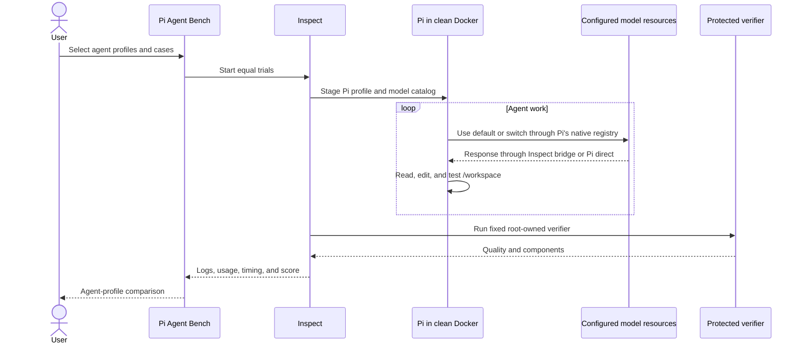

# Pi Agent Bench

Pi Agent Bench compares complete, reproducible coding-agent profiles on finished
repository outcomes.

The default question is:

> Which configured agent system produces the best finished outcome for the time
> and reported inference cost?

An agent profile is the deployed-style unit: one Pi configuration, one or more
available model resources, and one default model. A controlled model-only
comparison is still possible by defining otherwise-identical agent profiles
with different single model resources.

Inspect remains the evaluation framework:

- Inspect owns runs, limits, logs, scores, model usage, and detailed evidence.
- Pi Agent Bench adds the Pi adapter, clean Docker sandbox, cases, protected
  verifiers, reproducible profiles, generated cohort identity, and comparison
  dashboard.
- Inspect `.eval` logs are the source evidence. Files under `results/` are
  rebuildable exports.

## Architecture



Every trial gets a fresh workspace and private Pi home. The starting repository
is copied to `/workspace`; protected verifier source remains root-owned under
`/opt/verifiers` and is never copied into the agent workspace.

## Concepts

- **Case:** one requested finished outcome.
- **Dataset:** one versioned list of cases intended to be run together.
- **Candidate case:** a case still being authored, proved, or trialled before
  acceptance into a maintained dataset. There is no separate pilot case type.
- **Pi profile:** reusable Pi tools, instructions, skills, extensions, prompt
  templates, settings, runtime environment names, and MCP access.
- **Model profile:** reusable definition of one concrete inference resource and
  its bridge/direct execution contract.
- **Agent profile:** the complete runnable comparison unit, composing one Pi
  profile, ordered model resources, and a default resource.
- **Cohort fingerprint:** the shared use cases, evaluation rules, limits, cache
  condition, Pi/Inspect versions, execution protocol, and sandbox runtime. It
  deliberately excludes the agent profiles being compared and the trial count.
- **Benchmark ID:** one generated campaign ID shared by every agent profile in
  one `benchmark` invocation. It keeps repeated campaigns distinct.
- **Quality:** protected-verifier score from `0` to `1`.
- **Success:** quality meets the case threshold and every required component
  passes.

## Install on a clean Mac

Install Git, Python 3.11 or newer, and Docker Desktop:

```bash
brew install git python@3.11
brew install --cask docker
open -a Docker
```

Clone and bootstrap:

```bash
mkdir -p ~/Code
cd ~/Code
git clone https://github.com/barryking/pi-agent-bench.git
cd pi-agent-bench
./scripts/bootstrap-mac.sh
source .venv/bin/activate
```

Run Pi Agent Bench from this clone. A standalone package install is not
supported because the cases, verifiers, Docker sources, and dashboard belong
together.

## Configure profiles

Create ignored local files without overwriting existing values:

```bash
pi-bench init
```

Edit:

- `.env.local` for secret values and private addresses;
- `configs/model-baselines.local.json` for reusable inference resources;
- `configs/pi-profiles.local.json` for reusable Pi harness setups; and
- `configs/agent-profiles.local.json` for complete runnable profiles.

Never put resolved secrets in profile JSON.

### How the pieces compose

A model resource is not embedded in a Pi profile. A complete agent profile
binds the two:

```text
model resources: where and how inference is available
            +
Pi profile: tools, guidance, skills, extensions, prompts, MCP, and settings
            ↓
agent profile: available model-resource aliases + one default + one Pi profile
            ↓
benchmark run: one or more complete agent profiles on the same cases
```

Pi Agent Bench supplies the configured model catalog and the selected Pi
profile, then records what happened. It does not prescribe routing. Pi starts
with the default resource; instructions or a profiled extension may switch to
another available resource. A resource may remain unused in a valid run.

This supports two different comparisons:

- **several single-model agent profiles** for local-versus-cloud or
  cloud-versus-cloud controls; and
- **one multi-model agent profile** whose Pi behavior can use any configured
  mixture, such as cloud planning followed by local implementation.

### Model-resource examples

Most local and cloud APIs use `inspect-bridge`. Put addresses and keys in
`.env.local`, then put public, reproducible facts in
`configs/model-baselines.local.json`.

Example environment names:

```text
LOCAL_MODEL_BASE_URL=http://<local-server-address>:8000/v1
LOCAL_MODEL_API_KEY=<private-network-placeholder-or-real-key>
OLLAMA_BASE_URL=http://127.0.0.1:11434/v1
OPENROUTER_API_KEY=<secret>
OPENAI_API_KEY=<secret>
```

The following entries illustrate common resource shapes. Replace every
placeholder and record the exact model/runtime facts you actually measured.

#### DGX or another vLLM-compatible server

DGX Spark is one possible local server, not a requirement. The same shape
works for an OpenAI-compatible vLLM, SGLang, llama.cpp, or similar endpoint;
the part after `openai/` must exactly match an ID returned by `/v1/models`.

```json
"dgx-vllm": {
  "kind": "local",
  "model": "openai/nvidia/replace-with-served-model-id",
  "execution": {
    "mode": "inspect-bridge",
    "model_args": {},
    "model_args_env": {
      "base_url": "LOCAL_MODEL_BASE_URL",
      "api_key": "LOCAL_MODEL_API_KEY"
    },
    "generate_config": {"temperature": 0}
  },
  "capabilities": {
    "context_tokens": 131072,
    "max_output_tokens": 32768,
    "reasoning": true,
    "input": ["text"]
  },
  "configuration": {
    "weights": "replace-with-exact-model-and-revision",
    "runtime": "vllm",
    "runtime_version": "replace-with-installed-version",
    "quantisation": "replace-with-measured-format",
    "prefix_caching": false
  }
}
```

See [DGX model server setup](docs/setup-dgx.md) for the manual integration
walkthrough.

#### Ollama

Ollama has an OpenAI-compatible API and a native Inspect provider. Pull or
create the exact model first; the part after `ollama/` must match an ID from
Ollama's `/v1/models` response.

```json
"ollama-local": {
  "kind": "local",
  "model": "ollama/replace-with-ollama-model-tag",
  "execution": {
    "mode": "inspect-bridge",
    "model_args": {},
    "model_args_env": {"base_url": "OLLAMA_BASE_URL"},
    "generate_config": {"temperature": 0}
  },
  "capabilities": {
    "context_tokens": 65536,
    "max_output_tokens": 16384,
    "reasoning": true,
    "input": ["text"]
  },
  "configuration": {
    "weights": "replace-with-model-tag-and-digest",
    "runtime": "ollama",
    "runtime_version": "replace-with-installed-version",
    "context_configuration": "replace-with-measured-context",
    "quantisation": "replace-with-measured-format"
  }
}
```

#### OpenRouter

Inspect has a native OpenRouter provider. Use an exact OpenRouter model slug
when reproducibility matters; moving aliases may resolve to a different model
later. OpenRouter can route one model slug across several inference providers,
so pin the provider endpoint in `execution.model_args` when provider-specific
latency, cost, or behavior must remain comparable.

```json
"openrouter-planner": {
  "kind": "hosted",
  "model": "openrouter/replace-with-provider/replace-with-model-slug",
  "execution": {
    "mode": "inspect-bridge",
    "model_args": {
      "provider": {
        "order": ["replace-with-provider-endpoint-slug"],
        "allow_fallbacks": false,
        "require_parameters": true
      }
    },
    "model_args_env": {"api_key": "OPENROUTER_API_KEY"},
    "generate_config": {"temperature": 0}
  },
  "capabilities": {
    "context_tokens": 131072,
    "max_output_tokens": 32768,
    "reasoning": true,
    "input": ["text", "image"]
  },
  "configuration": {
    "provider": "OpenRouter",
    "model_revision": "replace-with-exact-canonical-slug",
    "routing": {
      "order": ["replace-with-provider-endpoint-slug"],
      "allow_fallbacks": false,
      "require_parameters": true
    }
  }
}
```

If you intentionally use OpenRouter's default routing, omit the `provider`
object and record that choice in `configuration.routing`; results can then
include routing variation outside the agent profile's control.

#### Direct provider API

Ordinary provider APIs follow the same pattern. Use Inspect's provider prefix,
for example `openai/<model>`, `anthropic/<model>`, or `google/<model>`, and map
the constructor's `api_key` to the appropriate host environment name.

```json
"openai-cloud": {
  "kind": "hosted",
  "model": "openai/replace-with-model-id",
  "execution": {
    "mode": "inspect-bridge",
    "model_args": {},
    "model_args_env": {"api_key": "OPENAI_API_KEY"},
    "generate_config": {"temperature": 0}
  },
  "capabilities": {
    "context_tokens": 131072,
    "max_output_tokens": 32768,
    "reasoning": true,
    "input": ["text", "image"]
  },
  "configuration": {
    "provider": "OpenAI",
    "model_revision": "replace-with-version-or-snapshot"
  }
}
```

OpenAI Codex subscription/OAuth is the initial `pi-direct` exception because
Inspect cannot instantiate that authentication path. See
[Model resources](docs/model-baselines.md) for that configuration. Bridged
credentials stay on the host; only selected Pi-direct authentication is staged
into the isolated Pi home.

### Bind resources into agent profiles

`configs/pi-profiles.local.json` defines Pi behavior. It starts with `vanilla`;
add a separate Pi profile when you want different guidance, skills, tools, MCP,
or extensions.

`configs/agent-profiles.local.json` then binds that behavior to available model
resources:

```json
{
  "version": 1,
  "profiles": {
    "dgx-only-agent": {
      "description": "Vanilla Pi with one DGX-hosted local model.",
      "pi_profile": "vanilla",
      "model_resources": ["dgx-vllm"],
      "default_model_resource": "dgx-vllm"
    },
    "openrouter-only-agent": {
      "description": "Vanilla Pi with one OpenRouter cloud model.",
      "pi_profile": "vanilla",
      "model_resources": ["openrouter-planner"],
      "default_model_resource": "openrouter-planner"
    },
    "planning-switcher-agent": {
      "description": "Profiled planning behavior with cloud and local resources.",
      "pi_profile": "planning-switcher",
      "model_resources": ["openrouter-planner", "dgx-vllm", "ollama-local"],
      "default_model_resource": "dgx-vllm"
    }
  }
}
```

The illustrative `planning-switcher` Pi profile must select and fingerprint
the instructions or extension that performs switching. The benchmark only
provides those three resource aliases and observes their use; it does not know
that one is a planner or implementer.

The resource order, aliases, default, and Pi profile are fingerprinted. For a
controlled model comparison, keep the Pi profile identical and define one
single-resource agent profile per model. For a multi-model-system comparison,
compare complete multi-resource agent profiles.

The templates reference JSON Schemas under `configs/schemas/`, so compatible
editors can validate profile names, required fields, and bridge/direct
execution forms while you edit.

List definitions using the local files created by `pi-bench init`:

```bash
pi-bench model-profiles
pi-bench pi-profiles
pi-bench agent-profiles
```

Check every component of one complete profile:

```bash
pi-bench doctor --agent-profile dgx-only-agent
```

For local resources, `doctor` checks `/v1/models` and verifies that the exact
configured service model is advertised before a benchmark starts.

## Run a benchmark

```bash
pi-bench benchmark \
  --agent-profile dgx-only-agent \
  --agent-profile openrouter-only-agent \
  --agent-profile planning-switcher-agent \
  --dataset evals/starter/cases.jsonl \
  --run-name starter-agent-systems-v1 \
  --epochs 3 \
  --resume
```

The benchmark inputs also become dashboard filters:

- `--dataset` selects the case file. Every case in that file must declare the
  same `metadata.dataset_version`. Change that version when changed cases or
  scoring should no longer be compared with earlier results.
- `--run-name` is a human label. It may be reused and is not comparison
  identity.
- `--benchmark-id` identifies one campaign across all selected profiles. It is
  generated and printed when omitted. Resume-mode IDs are stable for the same
  logs directory and run name; pass an explicit ID when extending a particular
  campaign.
- `--cache-state` records `cold`, `warm`, or `unspecified` model-inference
  cache conditions. This is a declaration, not an automatically detected
  measurement.
- `--epochs` sets the planned trials for this campaign. It is recorded but does
  not change the cohort because later campaigns may add compatible evidence.

The same profile-wide Pi guard supervises bridged, direct, and hybrid runs. It
counts Pi turns and assistant-message tokens and exits with code `75` when a
case limit is exceeded. The Docker process timeout enforces wall time. Inspect
continues to enforce bridged usage limits. `--cost-limit` is rejected for any
profile containing a Pi-direct resource until cumulative hybrid cost can be
enforced.

## Results

Open the comparison dashboard and Inspect viewer:

```bash
pi-bench view --results-dir results --logs-dir logs --inspect
```

### Dashboard filters

The dashboard derives its filter choices from the loaded `metrics.jsonl`:

- **Dataset version** chooses the case-set version declared by the dataset.
- **Comparison cohort** chooses one exact use-case/evaluation/environment
  fingerprint. Results from different cohorts are never aggregated.
- **Run name** defaults to **All runs**, pooling compatible campaigns within the
  selected cohort. Select one label to narrow the view.
- **Cache state** keeps cold, warm, and unspecified inference conditions
  separate.
- **Δ quality baseline** chooses the agent profile used only for the
  `Δ quality` column. It does not change absolute scores, rankings, time, cost,
  or the charts.
- **Shared cases only** keeps the intersection of case IDs present for every
  agent profile. It affects aggregate scores, charts, trends, and case-level
  evidence. The coverage matrix always shows the unfiltered coverage. Turning
  the filter off exposes all available results, but ranking remains disabled
  unless coverage and completed trial counts are identical.

The cohort fingerprint is the primary comparison boundary. Dataset version,
run name, and cache state remain useful human filters, but cannot cause records
from different cohort fingerprints to be combined.

The primary chart has one point per agent profile:

- x-axis: median wall time across all valid runs;
- y-axis: macro mean quality, averaging trials within cases first;
- bubble area: summed reported run cost;
- dashed outline: partial cost coverage; and
- hollow fixed marker: cloud cost unavailable.

The chart exposes the quality, time, and cost trade-off without prescribing
which combination is preferable. Profiles enter the same ranking only with
matching generated cohort identity, case coverage, and completed trial counts.

Each result persists:

- composed agent, Pi, and model-resource identities and fingerprints;
- default and available resources;
- observed model usage where telemetry supports it;
- separate bridged and direct usage aggregates;
- merged totals without counting bridge events twice;
- reported cost plus `complete`, `partial`, or `unavailable` coverage;
- cohort, verifier, harness, and sandbox evidence;
- benchmark campaign ID and planned trial information; and
- protected score details and the finished diff.

Local inference has complete zero inference cost. Missing cloud cost is never
treated as free. Reported inference cost is not total cost of ownership.

Rebuild result exports from logs:

```bash
pi-bench export --logs-dir logs --results-dir results
pi-bench report --results-dir results --output results/summary.md
```

Export treats Inspect logs as canonical: it replaces matching derived records
and removes stale valid records whose source logs are no longer present.

## Cases and verification

Case `instruction` is free text and may contain a realistic PRD, acceptance
criteria, constraints, migration notes, documentation expectations, and public
test requirements. It should describe observable finished behaviour without
revealing the protected verifier.

Normal benchmark users can run `evals/starter/cases.jsonl` directly. Its
starting repositories, verifiers, and automated known-good checks are
maintained in this repository. They do not need to run `prove-case`.

Case maintainers use this lifecycle:

```text
draft → structural validation → known-good proof → candidate trials → publication
```

Create a new draft as its own candidate dataset:

```bash
pi-bench new-case \
  --id outcome-example \
  --dataset evals/candidates/outcome-example/cases.jsonl \
  --dataset-version outcome-example-draft-1
```

`pi-bench validate` checks the case structure and referenced assets.
`pi-bench prove-case` is a maintainer step: it checks that the untouched
starting repository fails and a private known-good implementation passes. It
is not repeated for every benchmark run.

```bash
pi-bench validate evals/candidates/outcome-example/cases.jsonl
pi-bench build-sandbox
pi-bench prove-case \
  evals/candidates/outcome-example/cases.jsonl \
  --known-good-diff <private-known-good.diff> \
  --output results/case-proofs/outcome-example.json
```

After proof, set `metadata.draft` to `false` to permit candidate trial runs.
Trial results establish whether the instructions, verifier, difficulty, and
limits produce useful evidence. Publish an accepted case by adding it to a
maintained dataset and changing that dataset's version.

Change `metadata.dataset_version` when results should no longer be compared:
case membership, material instructions, starting code, verifier/scoring, or
meaningful limits changed. Do not change it for new profiles, models, runs,
trial counts, cache conditions, framework/Pi upgrades, or reporting changes;
the cohort fingerprint separates relevant execution-environment differences.

The only accepted protected command is:

```text
python3 /opt/verifiers/<case-id>/verify.py
```

## Development

Before changing framework behaviour, read the design and decision documents,
including [Agent Profiles as the Primary Benchmark Unit](docs/design/agent-profiles-primary-benchmark-unit.md).

Run all automated evidence:

```bash
python -m pip install -e ".[dev]"
scripts/check-all.sh
```

More guides:

- [Agent and Pi profiles](docs/agent-profiles.md)
- [Model resources](docs/model-baselines.md)
- [Metrics](docs/metrics.md)
- [Running evaluations](docs/running-evaluations.md)
- [Creating, proving, and publishing cases](docs/scoring-and-extending.md)
- [Architecture](docs/architecture.md)
- [Decisions](docs/decisions.md)
- [Roadmap](docs/roadmap.md)

Pi Agent Bench is available under the [MIT License](LICENSE).
